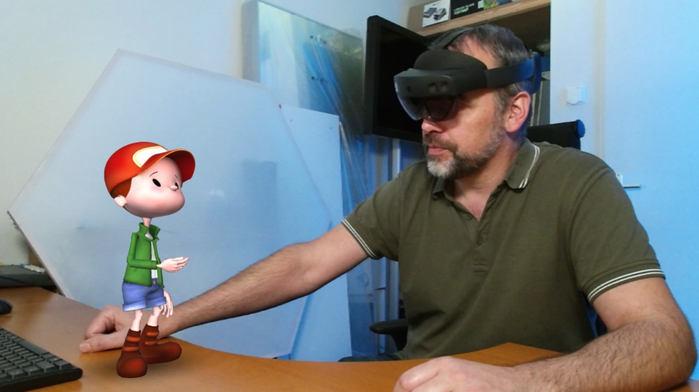

# Imaginary friend Part 2: Breathing life into a holographic character

Talk given at these event(s):
  * Global XR Conference, 3 November 2022

## Development environment

* Unity 2021.3.11f1
* MRTK 2.8.2 with OpenXR

